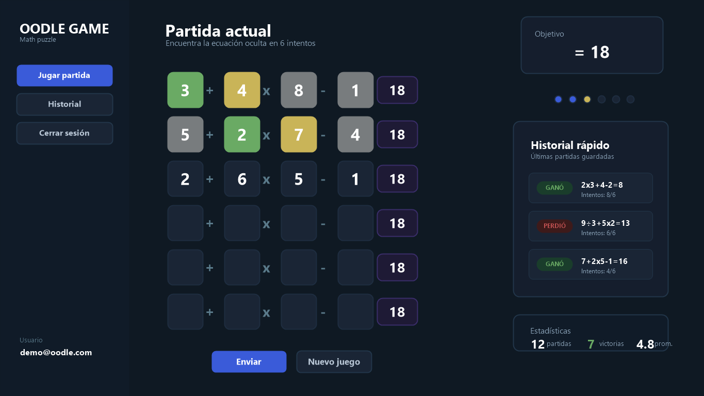
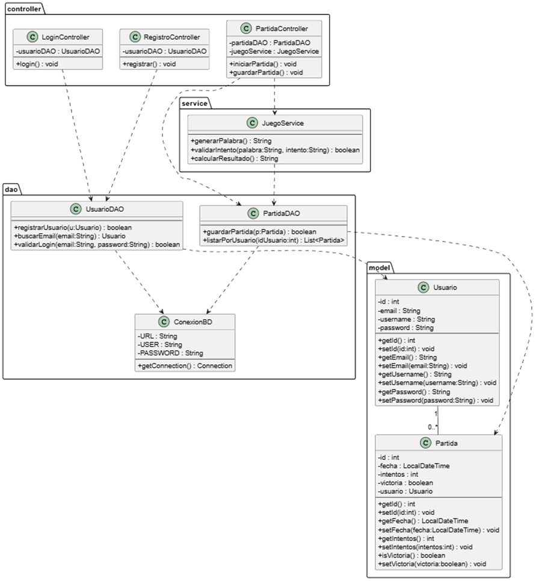
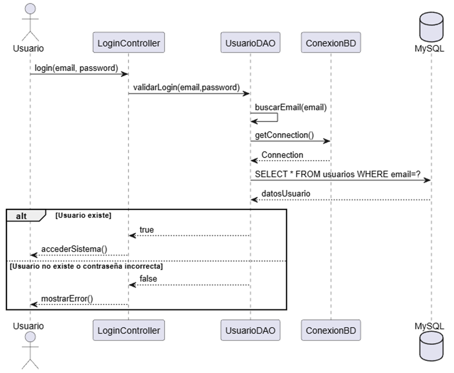
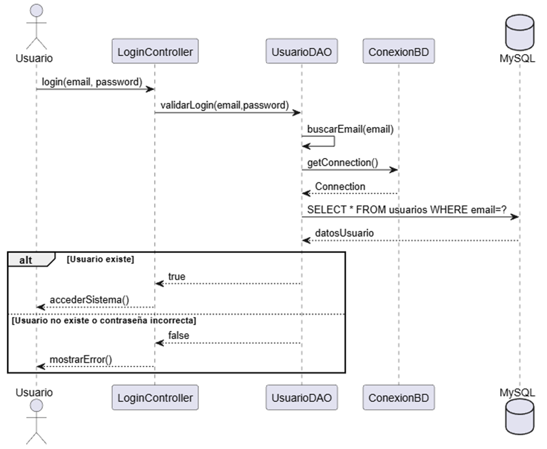
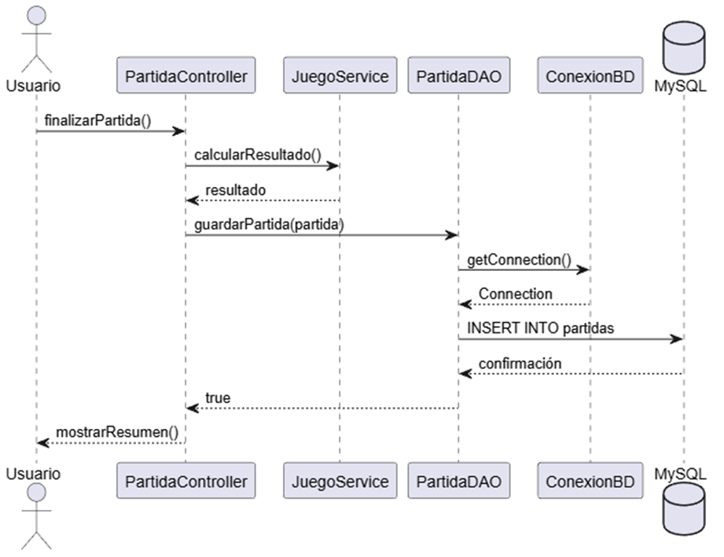

# Oodle Game

JavaFX mathematical puzzle game inspired by Oodle.  
Developed for the course "Práctica Aplicada a Sistemas".

---

## 1. Description

Oodle Game is a desktop application developed in Java 21 using JavaFX 21.  
The system implements a mathematical puzzle game with user authentication and persistence using a MySQL database.

The project follows a layered architecture based on the MVC pattern and the DAO design pattern to ensure separation of concerns, maintainability, and scalability.

---

## 2. Technologies Used

- Java 21
- JavaFX 21
- Maven
- MySQL 8
- JDBC
- Git and GitHub
- PlantUML (for UML modeling)

---

## 3. System Requirements

Before running the project, ensure the following software is installed:

- JDK 21
- MySQL Server
- Maven
- IntelliJ IDEA (recommended)

---

## 4. Database Configuration

The database schema required to run the project is included in the repository.

Location of the script:

docs/database/schema.sql

### Step-by-step database setup

1. Open MySQL Workbench or any MySQL client.
2. Connect to your local MySQL server.
3. Open the file located in the repository:

   docs/database/schema.sql

4. Execute the entire script.

Alternatively, using terminal:

```bash
mysql -u your_user -p < docs/database/schema.sql
```

Enter your MySQL password when prompted.

---

### Example of schema.sql content

If you have not created it yet, your `schema.sql` file should contain something similar to the following:

```sql
CREATE DATABASE IF NOT EXISTS oodle_game;
USE oodle_game;

CREATE TABLE IF NOT EXISTS usuarios (
    id INT AUTO_INCREMENT PRIMARY KEY,
    email VARCHAR(100) NOT NULL UNIQUE,
    username VARCHAR(50) NOT NULL,
    password VARCHAR(255) NOT NULL
);

CREATE TABLE IF NOT EXISTS partidas (
    id INT AUTO_INCREMENT PRIMARY KEY,
    usuario_id INT NOT NULL,
    fecha TIMESTAMP DEFAULT CURRENT_TIMESTAMP,
    resultado VARCHAR(50),
    puntaje INT,
    FOREIGN KEY (usuario_id) REFERENCES usuarios(id)
);
```

---

### Configure Database Credentials

After creating the database and tables, configure the connection in:

ConexionBD.java

```java
private static final String URL = "jdbc:mysql://localhost:3306/oodle_game";
private static final String USER = "your_user";
private static final String PASSWORD = "your_password";
```

Make sure the database name matches the one defined in `schema.sql`.

---

## 5. How to Run the Project

### Option 1 – Using IntelliJ IDEA

1. Open the project.
2. Wait for Maven to download dependencies.
3. Run the main class `HelloApplication.java`.

### Option 2 – Using Terminal

From the root directory of the project:

```bash
mvn clean install
mvn javafx:run
```

---

## 6. Project Architecture

The system is structured in layers as follows:

- **model**: System entities (Usuario, Partida).
- **dao**: Data access layer (UsuarioDAO, PartidaDAO, ConexionBD).
- **service**: Business logic layer.
- **controller**: JavaFX controllers.
- **resources**: FXML views and global CSS styles.
- **docs**: Documentation, mockups, and UML diagrams.

This architecture ensures modularity and clear separation of responsibilities.

---

## 7. Interface Mockup

The following image represents the general visual style defined through the global CSS.  
It does not correspond to the final functional screens of the system.



---

## 8. UML Diagrams

The system was modeled using PlantUML.  
Both the source files (`.puml`) and rendered images (`.png`) are included in the repository.

### 8.1 Class Diagram



### 8.2 Sequence Diagram – User Registration



### 8.3 Sequence Diagram – Login



### 8.4 Sequence Diagram – Save Game



---

## 9. Project Structure

```
oodle-game/
│
├── src/main/java/com/example/oodlegame
│   ├── model
│   ├── dao
│   ├── util
│   ├── controller
│
├── src/main/resources
│   ├── fxml
│   ├── css
│
├── docs
│   ├── mockups
│   ├── diagrams
│
└── pom.xml
```

---

## 10. Author

Juan Camilo Bejarano  
Práctica Aplicada a Sistemas