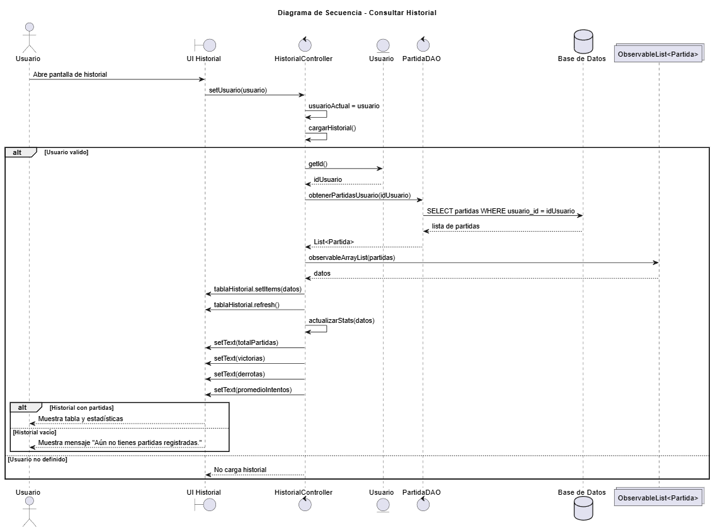

# Oodle Game

JavaFX mathematical puzzle game inspired by Oodle.  
Developed for the course "Práctica Aplicada a Sistemas".

---

## 1. Description

Oodle Game is a desktop application developed in Java 21 using JavaFX 21.  
The system implements a mathematical puzzle game where users must guess the hidden equation in a maximum of six attempts.

The application includes user registration, login, match history, and persistence using a MySQL database.

The project follows a layered architecture based on the MVC pattern and the DAO design pattern to separate the user interface, application logic, data models, and database access.

---

## 2. Technologies Used

- Java 21
- JavaFX 21
- Maven
- MySQL 8
- JDBC
- Git and GitHub
- PlantUML

---

## 3. System Requirements

Before running the project, ensure the following software is installed:

- JDK 21
- MySQL Server
- Maven
- IntelliJ IDEA (recommended)

---

## 4. Database Configuration

The database schema required to run the project is included in the repository.

Script location:

```text
docs/database/schema.sql
```

### Step-by-step database setup

1. Open MySQL Workbench or any MySQL client.
2. Connect to your local MySQL server.
3. Open the file located at:

```text
docs/database/schema.sql
```

4. Execute the entire script.

Alternatively, using terminal:

```bash
mysql -u your_user -p < docs/database/schema.sql
```

Enter your MySQL password when prompted.

---

### Example of schema.sql content

The current database design stores registered users and completed matches.  
Attempts are managed in memory during the game and are not stored in a separate table.

```sql
CREATE DATABASE IF NOT EXISTS oodle_game;
USE oodle_game;

CREATE TABLE IF NOT EXISTS usuarios (
    id INT AUTO_INCREMENT PRIMARY KEY,
    email VARCHAR(100) NOT NULL UNIQUE,
    username VARCHAR(50) NOT NULL UNIQUE,
    password VARCHAR(255) NOT NULL
);

CREATE TABLE IF NOT EXISTS partidas (
    id INT AUTO_INCREMENT PRIMARY KEY,
    usuario_id INT NOT NULL,
    ecuacion_objetivo VARCHAR(50) NOT NULL,
    intentos_usados INT NOT NULL,
    victoria BOOLEAN NOT NULL,
    fecha DATETIME NOT NULL DEFAULT CURRENT_TIMESTAMP,
    FOREIGN KEY (usuario_id) REFERENCES usuarios(id)
);
```

---

### Configure Database Credentials

After creating the database and tables, configure the connection in:

```text
src/main/java/com/example/oodlegame/util/ConexionBD.java
```

```java
private static final String URL = "jdbc:mysql://localhost:3306/oodle_game";
private static final String USER = "your_user";
private static final String PASSWORD = "your_password";
```

Make sure the database name matches the one defined in `schema.sql`.

---

## 5. How to Run the Project

### Option 1 - Using IntelliJ IDEA

1. Open the project.
2. Wait for Maven to download dependencies.
3. Run the main class:

```text
src/main/java/com/example/oodlegame/HelloApplication.java
```

### Option 2 - Using Terminal

From the root directory of the project:

```bash
mvn clean install
mvn javafx:run
```

---

## 6. Project Architecture

The system is structured in layers as follows:

- **model**: System entities, such as `Usuario`, `Partida`, and `Intento`.
- **controller**: JavaFX controllers that manage the interaction between the views and the application logic.
- **service**: Data access classes, such as `UsuarioDAO` and `PartidaDAO`.
- **util**: Utility classes, such as the database connection class.
- **resources**: FXML views, images, and CSS styles.
- **docs**: Project documentation, database scripts, mockups, and UML diagrams.

Although `Intento` exists as a model class, the attempts are handled during the execution of a match and are not persisted in an independent database table.

---

## 7. Interface Mockup

The following image represents the visual design reference used for the application interface.


---

## 8. UML Diagrams

The system was modeled using PlantUML.  
The rendered diagrams are included in the repository.

### 8.1 Class Diagram


### 8.2 Sequence Diagram - User Registration


### 8.3 Sequence Diagram - Login


### 8.4 Sequence Diagram - Play Game


### 8.5 Sequence Diagram - Match History



---

## 9. Project Structure

```text
oodleGame/
│
├── docs/
│   ├── database/
│   ├── diagrams/
│   │   ├── clases.png
│   │   ├── secuenciaHistorial.png
│   │   ├── secuenciaLogin.png
│   │   ├── secuenciaPartida.png
│   │   └── secuenciaRegistro.png
│   └── mockups/
│
├── src/
│   └── main/
│       ├── java/
│       │   ├── com.example.oodlegame/
│       │   │   ├── controller/
│       │   │   ├── model/
│       │   │   ├── service/
│       │   │   ├── util/
│       │   │   ├── HelloApplication.java
│       │   │   └── HelloController.java
│       │   └── module-info.java
│       │
│       └── resources/
│           ├── com.example.oodlegame/
│           │   ├── images/
│           │   ├── hello-view.fxml
│           │   ├── historial.fxml
│           │   ├── Login.fxml
│           │   ├── Menu.fxml
│           │   ├── Partida.fxml
│           │   └── Registro.fxml
│           └── css/
│
├── .gitignore
├── mvnw
├── mvnw.cmd
└── pom.xml
```

---

## 10. Author

Juan Camilo Bejarano  
Práctica Aplicada a Sistemas
